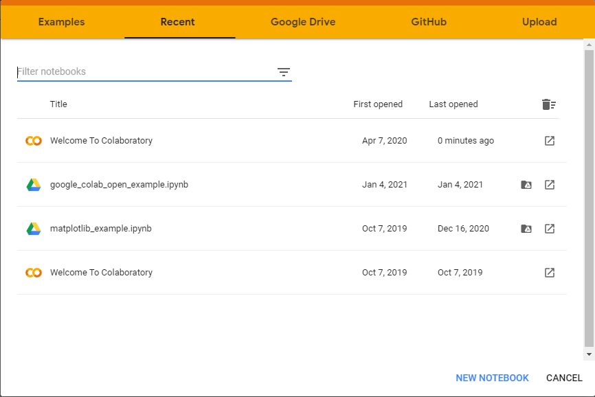
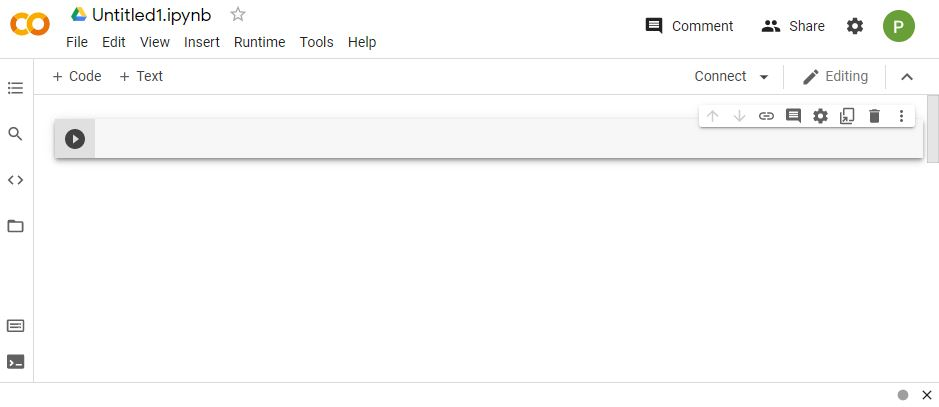
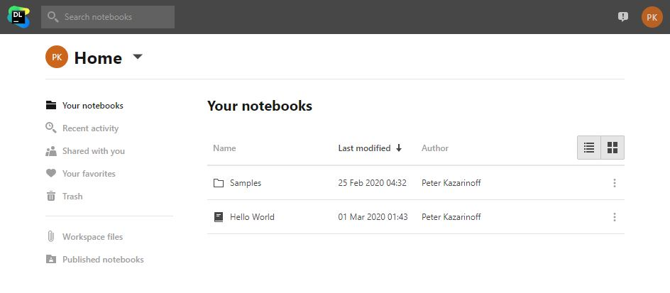
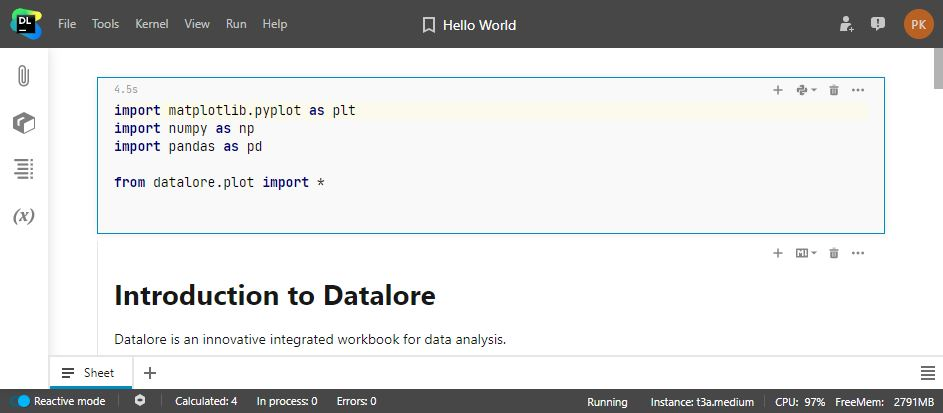

## Python Free Online

You may not be able to install the Anaconda distribution of Python. A couple reasons you might not be able to install Anaconda are:

 * You are using a school or work computer that you can't install programs.
 * You are using a Chromebook or tablet and Anaconda can't be installed on it
 * Your Anaconda installation failed and you can't figure out why

If you can't install Anaconda, you can still use Python for free with a couple different online resources. These options include:

 * **Google CoLab**
 * **Datalore** (from JetBrains)

Both of these options require a username and password for the particular service and all both are free.

### Google CoLab

If you have access to the Google suite of online tools such as Gmail, Google Calendar and Google Drive, Google CoLab is a good free Python option.

When you write Python code in Google CoLab, your code is saved in your Google Drive onlong side you Google Docs and Google Sheets.

You can access Google CoLab using the web address below:

 > [https://colab.google.com](https://colab.google.com)

This will create a new notebook that you can write Python code in and provides you with the ability to run that Python code as well. 

### Datalore

Datalore was created by Jet Brains, the company that makes PyCharm. PyCharm is an IDE (Integrated Development Environment) for Python. Datalore is only free online option to write and run Python code.

You can create a Datalore account using the URL below:

 > [https://datalore.jetbrains.com/](https://datalore.jetbrains.com/)

You can also log in with a JetBrains or Google account. Datalore notebooks operate with a couple differences compared to Jupyter notebooks running on your computer, but for the type of work descriped in these resources, the differences are minimal.
