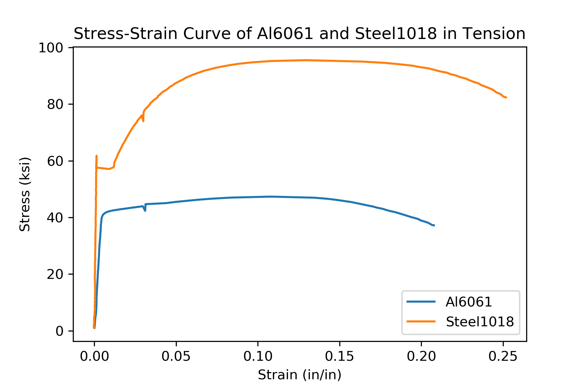

# Engineering-Materials-Programming

A growing repo of Computer Programming resources for an undergraduate Engineering Materials class. This type of class is often completed by mechanical engineering students during their second year of college.

